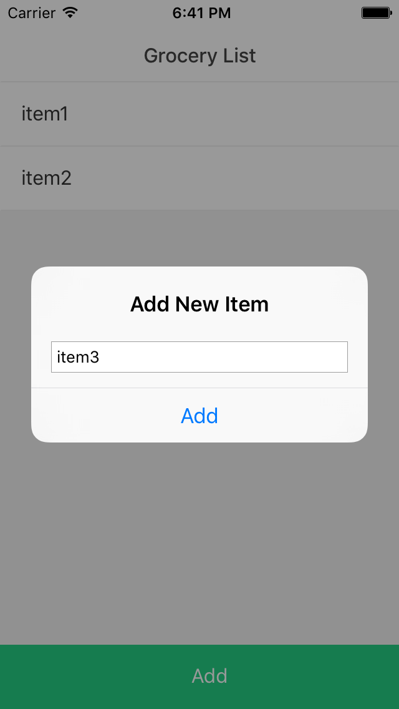
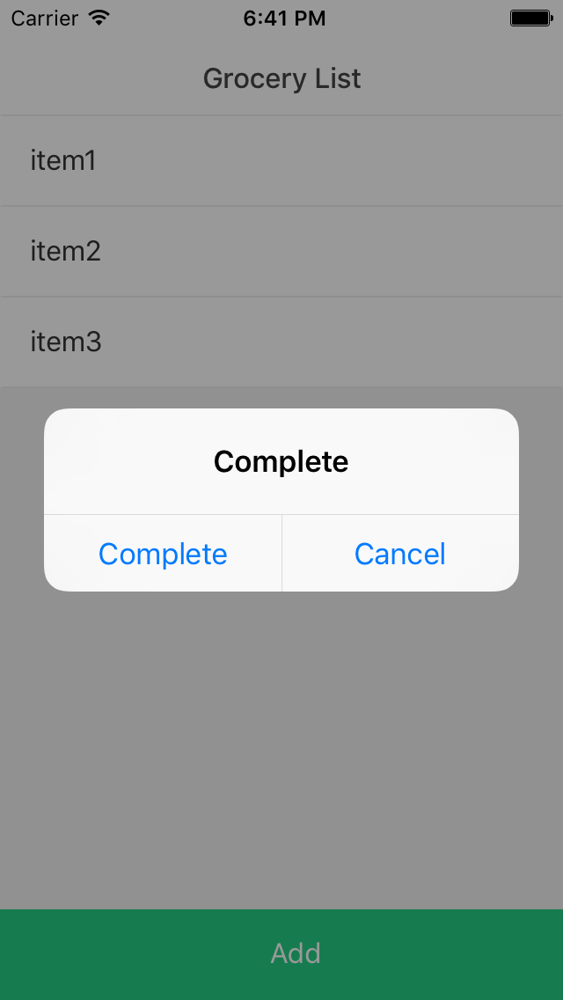

# Demo_FirebaseRN

## How to use 

1. Go to https://console.firebase.google.com 
2. Creat a projct.
3. Copy `src/confg.sample.js` to `src/confg.js`
4. Edit and paste your key info :

```
apiKey: "<your-api-key>",
authDomain: "<your-auth-domain>",
databaseURL: "<your-database-url>",
storageBucket: "<your-storage-bucket>",
```

Change you database rule (Database -> Rule) :

```
{
  "rules": {
    ".read": "auth == null",
    ".write": "auth == null"
  }
}
```

## Screenshot





